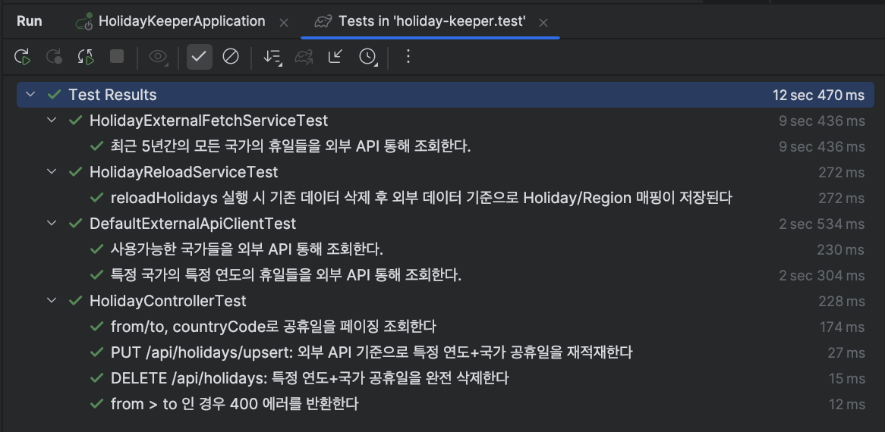

# holiday-keeper

외부 공휴일 API를 기반으로  
• 대량 초기 적재  
• 연도·국가 단위 덮어쓰기  
• 연도·국가·지역 기반 조회  
• 매년 정기 스케줄링  
을 제공하는 Spring Boot 3.4 / Java 21 기반 프로젝트입니다.

---

## 🏗 기술 스택

#### - Java 21  
#### - Spring Boot 3.4.x
#### - Spring Web / JPA / Scheduling
#### - Querydsl 5
#### - H2 Database (local test)
#### - springdoc-openapi (Swagger UI)
#### - Gradle 8.x

---

## 📦 빌드 & 실행 방법

### 1. 프로젝트 빌드
```bash
./gradlew clean build
```

### 2. 애플리케이션 실행
```bash
./gradlew bootRun
```

### 3. 테스트
```bash
./gradlew test
```

---

## 📘 REST API 명세 요약

### 1) 공휴일 조회 API

#### GET /api/holidays

#### 요청 파라미터

|이름|타입|설명|
|---|---|---|
|from|Integer|조회 시작 연도 (옵션)|
|to|Integer|조회 종료 연도 (옵션)|
|countryCode|String|국가 코드 (ISO-3166-1, 예:KR, US)|
|regionIso|String|지역 코드 (ISO-3166-2, 예: US-TX)|
|type|Enum|공휴일 타입 (PUBLIC, BANK, SCHOOL 등)|
|page / size|Integer|페이징 옵션|

> **유효성 제약:**  
from ≤ to 여야 합니다.  
잘못된 경우 400 Bad Request + 에러 JSON 응답 반환.

#### 응답 예시
```json
{
  "content": [
    {
      "id": 1,
      "countryCode": "KR",
      "date": "2025-01-01",
      "localName": "새해 첫날",
      "name": "New Year's Day",
      "fixed": true,
      "global": true,
      "launchYear": 1949,
      "types": ["PUBLIC"],
      "regionIsoCodes": ["KR"]
    }
  ],
  "totalElements": 20,
  "totalPages": 2,
  "size": 10,
  "number": 0
}
```

### 2) 공휴일 삭제 API

#### DELETE /api/holidays

#### 요청 파라미터

|이름|타입| 설명 |
|---|---|---|
|year|Integer|삭제할 연도 (필수)|
|countryCode|String|국가 코드 (필수)|

#### 기능
•해당 연도+국가의 모든 Holiday / HolidayRegion을 hard delete

#### 응답
•204 No Content

### 3) 공휴일 덮어쓰기 API

#### PUT /api/holidays/upsert

#### 요청 파라미터

|이름|타입| 설명 |
|---|---|---|
|year|Integer|대상 연도|
|countryCode|String|국가 코드|

#### 동작 과정
1.	기존 Holiday 삭제
2.	외부 API 호출
3.	Holiday + HolidayRegion 새로 insert

#### 응답 예시
```json
{
  "upsertedCount": 25
}
```

---

## 🔄 배치 스케줄링 (정기 동기화)

### 매년 1월 2일 01:00 (KST) 에 실행
•전년도 + 금년도 대상  
•모든 지원 국가 코드에 대해 upsert 수행

```java
@Scheduled(cron = "0 0 1 2 1 *", zone = "Asia/Seoul")
public void syncHolidays() { ... }
```
---

## 🧪 테스트

전체 테스트는 다음 명령으로 실행됩니다:
```bash
./gradlew clean test
```

### 테스트 성공 스크린샷


---
## 📄 Swagger / OpenAPI 문서

springdoc-openapi 를 기반으로 자동 생성됩니다.

### Swagger UI 접속
> http://localhost:8080/swagger-ui.html

### OpenAPI JSON 문서
> http://localhost:8080/v3/api-docs

---

